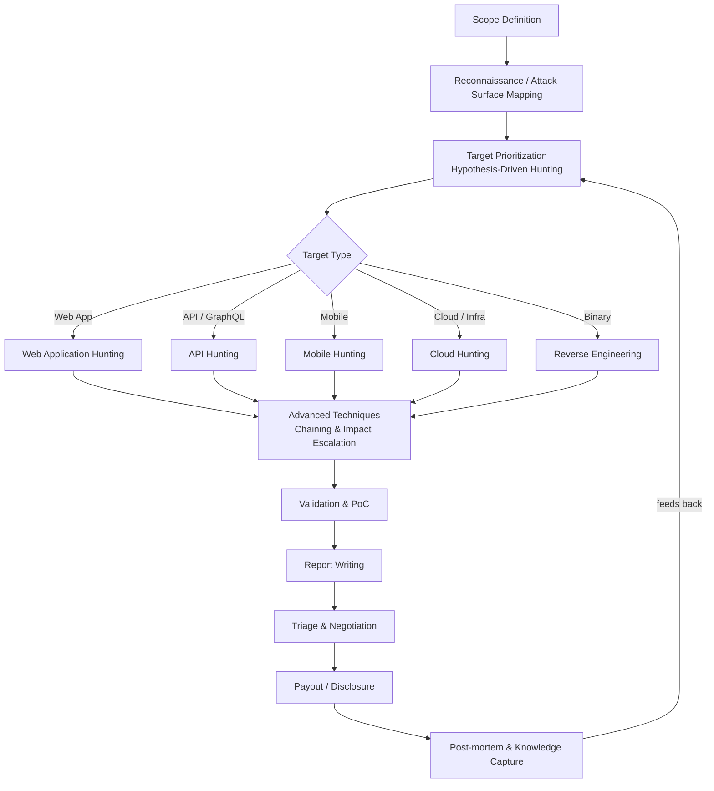

# 🐛 BugLibrary — La Bible du Bug Hunting

<p align="center">
  
  
  
  
  
</p>

<p align="center"><i>Référence ultime pour hunters avancés à experts — humains et agents IA.<br/>The ultimate reference for advanced-to-expert hunters — human and AI agents alike.</i></p>

---

## 🇫🇷 Français

### Qu'est-ce que BugLibrary ?

BugLibrary est une **documentation de référence exhaustive** pour la recherche de vulnérabilités et le bug bounty, écrite au niveau des meilleurs chercheurs mondiaux (top 1% HackerOne/Bugcrowd/Intigriti). Ce n'est pas un tutoriel pour débutants : c'est une bibliothèque de méthodologies, de techniques, de checklists et de templates conçue pour être utilisée **en conditions réelles**, par des humains ou des agents IA orchestrés.

### Pourquoi ce dépôt existe

La majorité de la doc bug bounty publique est soit trop basique (OWASP Top 10 101), soit dispersée en 200 threads Twitter/X impossibles à retrouver. BugLibrary consolide :
- Des **méthodologies structurées** (mapping de surface d'attaque, hunting piloté par hypothèses)
- Des **techniques modernes 2024-2026**, y compris les moins documentées
- Des **checklists actionnables**, pas des listes théoriques
- Des **templates de rapport** qui maximisent les payouts
- Une **stratégie d'usage d'agents IA** pour industrialiser la recherche

### Structure du dépôt

```
BugLibrary/
├── docs/
│   ├── 00-Introduction/                  → Comment utiliser cette bibliothèque
│   ├── 01-Mindset-and-Methodology/       → PTES adapté bug bounty, hunting piloté par hypothèses
│   ├── 02-Reconnaissance/                → Attack surface mapping, OSINT, subdomain/asset discovery
│   ├── 03-Web-Application-Hunting/       → XSS, SQLi, SSRF, auth, logique métier, upload, désérialisation
│   ├── 04-API-GraphQL-Hunting/           → REST, GraphQL, gRPC, WebSocket
│   ├── 05-Mobile-Hunting/                → Android/iOS, reverse, API mobiles
│   ├── 06-Cloud-and-Infrastructure/      → AWS/GCP/Azure, Kubernetes, IaC misconfig
│   ├── 07-Binary-and-Reverse-Engineering/→ Reverse binaire, fuzzing, memory corruption
│   ├── 08-Advanced-Techniques/           → Request smuggling, cache poisoning, race conditions, prototype pollution
│   ├── 09-Automation-and-Tooling/        → Stack d'outils, pipelines, agents IA en bug hunting
│   ├── 10-Reporting-and-Communication/   → Rédaction de rapports, négociation, triage
│   ├── 11-Legal-Ethics-and-OPSEC/        → Scope, légalité, OPSEC, rate limiting
│   ├── 12-Checklists-and-CheatSheets/    → Checklists exhaustives prêtes à l'emploi
│   ├── 13-Case-Studies/                  → Études de cas anonymisées
│   └── 14-Resources-and-Continuous-Learning/ → Veille, formation continue
├── templates/                             → Templates de rapport, recon, triage
├── tools/                                 → Stack d'outils recommandée + configs
├── scripts/                               → Scripts d'automatisation recon/scan
└── assets/                                → Diagrammes, images
```

### Par où commencer ?

| Profil | Point d'entrée |
|---|---|
| Nouveau hunter avancé | [`01-Mindset-and-Methodology`](docs/01-Mindset-and-Methodology/README.md) |
| Tu as un scope, tu veux mapper la surface | [`02-Reconnaissance`](docs/02-Reconnaissance/README.md) |
| Tu chasses sur une webapp | [`03-Web-Application-Hunting`](docs/03-Web-Application-Hunting/README.md) |
| Tu chasses sur une API/GraphQL | [`04-API-GraphQL-Hunting`](docs/04-API-GraphQL-Hunting/README.md) |
| Tu orchestres des agents IA | [`09-Automation-and-Tooling/AI-Agents-in-Bug-Hunting.md`](docs/09-Automation-and-Tooling/AI-Agents-in-Bug-Hunting.md) |
| Tu as trouvé un bug, tu rédiges | [`templates/bug-report-template.md`](templates/bug-report-template.md) |
| Tu veux une checklist rapide | [`12-Checklists-and-CheatSheets`](docs/12-Checklists-and-CheatSheets/README.md) |

### Living Document

Ce dépôt est **vivant par conception** : les payloads deviennent obsolètes, les WAF évoluent, les frameworks changent leurs défauts de sécurité. Voir [`14-Resources-and-Continuous-Learning`](docs/14-Resources-and-Continuous-Learning/README.md) pour le protocole de mise à jour. Contributions bienvenues — voir [`CONTRIBUTING.md`](CONTRIBUTING.md).

### Avertissement légal

Tout le contenu de ce dépôt est destiné à une **utilisation légale et autorisée uniquement** : programmes de bug bounty en scope, pentests sous contrat, labs personnels. Voir [`11-Legal-Ethics-and-OPSEC`](docs/11-Legal-Ethics-and-OPSEC/README.md) et [`CODE_OF_CONDUCT.md`](CODE_OF_CONDUCT.md).

---

## 🇬🇧 English

### What is BugLibrary?

BugLibrary is an **exhaustive reference documentation** for vulnerability research and bug bounty hunting, written at the level of the world's best researchers (top 1% HackerOne/Bugcrowd/Intigriti). This is not a beginner tutorial — it's a library of methodologies, techniques, checklists, and templates built for **real-world use**, by humans or orchestrated AI agents.

### Why this repo exists

Most public bug bounty content is either too basic (OWASP Top 10 101) or scattered across 200 unrecoverable Twitter/X threads. BugLibrary consolidates:
- **Structured methodologies** (attack surface mapping, hypothesis-driven hunting)
- **Modern 2024-2026 techniques**, including under-documented ones
- **Actionable checklists**, not theoretical lists
- **Report templates** that maximize payouts
- An **AI agent orchestration strategy** to industrialize research

### Repository structure

See the French section above — identical structure, folder names are language-agnostic.

### Where to start?

| Profile | Entry point |
|---|---|
| New advanced hunter | [`01-Mindset-and-Methodology`](docs/01-Mindset-and-Methodology/README.md) |
| You have a scope, want to map the surface | [`02-Reconnaissance`](docs/02-Reconnaissance/README.md) |
| Hunting on a webapp | [`03-Web-Application-Hunting`](docs/03-Web-Application-Hunting/README.md) |
| Hunting on an API/GraphQL | [`04-API-GraphQL-Hunting`](docs/04-API-GraphQL-Hunting/README.md) |
| Orchestrating AI agents | [`09-Automation-and-Tooling/AI-Agents-in-Bug-Hunting.md`](docs/09-Automation-and-Tooling/AI-Agents-in-Bug-Hunting.md) |
| Found a bug, writing it up | [`templates/bug-report-template.md`](templates/bug-report-template.md) |
| Want a quick checklist | [`12-Checklists-and-CheatSheets`](docs/12-Checklists-and-CheatSheets/README.md) |

### Living Document

This repo is **living by design**: payloads go stale, WAFs evolve, frameworks change their security defaults. See [`14-Resources-and-Continuous-Learning`](docs/14-Resources-and-Continuous-Learning/README.md) for the update protocol. Contributions welcome — see [`CONTRIBUTING.md`](CONTRIBUTING.md).

### Legal disclaimer

All content in this repository is intended for **legal, authorized use only**: in-scope bug bounty programs, contracted pentests, personal labs. See [`11-Legal-Ethics-and-OPSEC`](docs/11-Legal-Ethics-and-OPSEC/README.md) and [`CODE_OF_CONDUCT.md`](CODE_OF_CONDUCT.md).

---

## 🗺️ Vue d'ensemble de la méthodologie / Methodology Overview



## 📜 Licence

MIT — voir [`LICENSE`](LICENSE).

## 🤝 Contribuer

Voir [`CONTRIBUTING.md`](CONTRIBUTING.md) / See [`CONTRIBUTING.md`](CONTRIBUTING.md).
