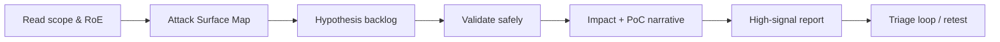

# BugLibrary

[](./LICENSE)
[](./docs/)
[](./docs/14-Resources-and-Continuous-Learning/living-document.md)
[](#english)
[](#français--english)

> **The elite bug-hunting reference library** — methodology, recon, web/API/mobile/cloud/binary techniques, automation, AI agent workflows, reporting that pays, and OPSEC — for authorized research only.  
> **La bible du bug hunting d’élite** — méthodologie, recon, techniques web/API/mobile/cloud/binaire, automation, agents IA, reporting qui maximise les bounties, et OPSEC — recherche autorisée uniquement.

---

## English

### Purpose

**BugLibrary** is a structured, production-grade knowledge base for:

- Elite human bug bounty hunters (advanced → expert)
- AI hunting agents and multi-agent orchestrations
- Red-team / AppSec engineers operating under clear Rules of Engagement

It is **not** a payload dump, malware repo, or guide to illegal hacking. Every technique assumes **written authorization** (bug bounty program, VDP, or contracted pentest).

### Who this is for

| Persona | How you use BugLibrary |
|---------|------------------------|
| Solo hunter | Attack-surface mapping → hypothesis → validate → report |
| Team lead | Shared checklists, report templates, triage standards |
| AI agent / orchestrator | Section indexes, prompts, workflow contracts in `docs/09` & `docs/08` |
| Mentor / coach | Case studies + methodology rails for juniors under supervision |

### Repository map

```text
BugLibrary/
├── README.md                 ← you are here (FR + EN)
├── CONTRIBUTING.md
├── CODE_OF_CONDUCT.md
├── LICENSE                   ← MIT
├── docs/
│   ├── 00-Introduction/
│   ├── 01-Mindset-and-Methodology/
│   ├── 02-Reconnaissance/
│   ├── 03-Web-Application-Hunting/
│   ├── 04-API-GraphQL-Hunting/
│   ├── 05-Mobile-Hunting/
│   ├── 06-Cloud-and-Infrastructure/
│   ├── 07-Binary-and-Reverse-Engineering/
│   ├── 08-Advanced-Techniques/      ← includes AI agents
│   ├── 09-Automation-and-Tooling/
│   ├── 10-Reporting-and-Communication/
│   ├── 11-Legal-Ethics-and-OPSEC/
│   ├── 12-Checklists-and-CheatSheets/
│   ├── 13-Case-Studies/
│   └── 14-Resources-and-Continuous-Learning/  ← Living Document
├── templates/                ← bounty-maximizing report scaffolds
├── tools/                    ← safe helper docs / wrappers (no exploits)
├── scripts/                  ← non-weaponized utility scripts
└── assets/                   ← diagrams & media
```

### Quick start (hunter path)



1. **Legal first** → [`docs/11-Legal-Ethics-and-OPSEC`](./docs/11-Legal-Ethics-and-OPSEC/)
2. **Mindset & method** → [`docs/01-Mindset-and-Methodology`](./docs/01-Mindset-and-Methodology/)
3. **Recon** → [`docs/02-Reconnaissance`](./docs/02-Reconnaissance/)
4. **Domain playbooks** → Web / API / Mobile / Cloud / Binary (`03`–`07`)
5. **Report for payout** → [`docs/10-Reporting-and-Communication`](./docs/10-Reporting-and-Communication/) + [`templates/`](./templates/)
6. **AI agents** → [`docs/08-Advanced-Techniques/ai-agents-bug-hunting.md`](./docs/08-Advanced-Techniques/ai-agents-bug-hunting.md)

### Documentation index

| # | Section | Focus |
|---|---------|--------|
| 00 | [Introduction](./docs/00-Introduction/) | Mission, how to use the library, skill ladder |
| 01 | [Mindset & Methodology](./docs/01-Mindset-and-Methodology/) | PTES-adapted BB, hypothesis-driven hunting, prioritization |
| 02 | [Reconnaissance](./docs/02-Reconnaissance/) | ASM, OSINT, assets, differential recon |
| 03 | [Web Application Hunting](./docs/03-Web-Application-Hunting/) | Auth, access control, injection, modern frontends |
| 04 | [API & GraphQL Hunting](./docs/04-API-GraphQL-Hunting/) | REST, GraphQL, BOLA/BFLA, mass assignment |
| 05 | [Mobile Hunting](./docs/05-Mobile-Hunting/) | Android/iOS static+dynamic, API pivot |
| 06 | [Cloud & Infrastructure](./docs/06-Cloud-and-Infrastructure/) | Cloud misconfig classes, SSRF→cloud, edge |
| 07 | [Binary & Reverse Engineering](./docs/07-Binary-and-Reverse-Engineering/) | RE workflow for BB targets |
| 08 | [Advanced Techniques](./docs/08-Advanced-Techniques/) | Chaining, race conditions, AI agents |
| 09 | [Automation & Tooling](./docs/09-Automation-and-Tooling/) | Pipelines, rate limits, signal quality |
| 10 | [Reporting & Communication](./docs/10-Reporting-and-Communication/) | Impact writing, triage psychology |
| 11 | [Legal, Ethics & OPSEC](./docs/11-Legal-Ethics-and-OPSEC/) | Scope, rate limits, stealth, privacy |
| 12 | [Checklists & CheatSheets](./docs/12-Checklists-and-CheatSheets/) | Day-of-hunt checklists |
| 13 | [Case Studies](./docs/13-Case-Studies/) | Educational, anonymized patterns |
| 14 | [Resources & Continuous Learning](./docs/14-Resources-and-Continuous-Learning/) | Living Document, maintenance |

### Design principles

1. **Results over theory** — every page should change how you hunt tomorrow  
2. **Hypothesis-driven** — map surface → generate tests → kill or prove  
3. **Payment-aware reporting** — clarity + impact + reproducibility  
4. **AI-augmented, human-accountable** — agents accelerate; humans own scope & ethics  
5. **Living document** — dated updates, PR discipline, deprecation of stale advice  

### Contributing

See [CONTRIBUTING.md](./CONTRIBUTING.md). Hard rules: no malware, no out-of-scope attack kits, no private disclosure dumps.

### License

[MIT](./LICENSE) — use, fork, and extend freely. Attribution appreciated.

### Disclaimer

Educational content for **authorized** security research. You are solely responsible for compliance with law, platform policies, and program rules. The authors are not liable for misuse.

---

## Français

### Objectif

**BugLibrary** est une base de connaissances structurée, de niveau production, pour :

- Hunters bug bounty d’élite (avancé → expert)
- Agents IA de hunting et orchestrations multi-agents
- Ingénieurs red-team / AppSec sous Rules of Engagement claires

Ce n’est **pas** un dépôt de payloads, de malware, ni un guide de piratage illégal. Toute technique suppose une **autorisation écrite** (programme bug bounty, VDP ou pentest contractuel).

### Public cible

| Persona | Usage |
|---------|--------|
| Hunter solo | Cartographie surface → hypothèses → validation → rapport |
| Lead d’équipe | Checklists partagées, standards de triage, templates |
| Agent IA / orchestrateur | Index de sections, prompts, contrats de workflow |
| Mentor | Études de cas + rails méthodologiques |

### Démarrage rapide (chemin hunter)

1. **Légal d’abord** → [`docs/11-Legal-Ethics-and-OPSEC`](./docs/11-Legal-Ethics-and-OPSEC/)  
2. **Mindset & méthode** → [`docs/01-Mindset-and-Methodology`](./docs/01-Mindset-and-Methodology/)  
3. **Recon** → [`docs/02-Reconnaissance`](./docs/02-Reconnaissance/)  
4. **Playbooks domaine** → Web / API / Mobile / Cloud / Binaire (`03`–`07`)  
5. **Reporting qui paie** → [`docs/10`](./docs/10-Reporting-and-Communication/) + [`templates/`](./templates/)  
6. **Agents IA** → [`docs/08/.../ai-agents-bug-hunting.md`](./docs/08-Advanced-Techniques/ai-agents-bug-hunting.md)  

### Principes de conception

1. **Résultats avant théorie**  
2. **Hunting piloté par hypothèses**  
3. **Reporting orienté impact / payout**  
4. **IA en accélérateur, humain responsable**  
5. **Living Document** — mises à jour datées, maintenance disciplinée  

### Contribuer

Voir [CONTRIBUTING.md](./CONTRIBUTING.md). Interdit : malware, kits d’attaque hors scope, fuites de divulgations privées.

### Licence

[MIT](./LICENSE).

### Avertissement

Contenu éducatif pour la recherche de sécurité **autorisée**. Vous êtes seul responsable du respect de la loi, des politiques des plateformes et des règles des programmes.

---

## Living Document

This library is intentionally incomplete forever — security moves.  
See the maintenance process:  
→ [docs/14-Resources-and-Continuous-Learning/living-document.md](./docs/14-Resources-and-Continuous-Learning/living-document.md)

---

**Built for elite hunters. Use it legally. Ship better reports. Keep learning.**
