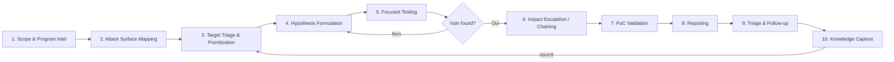
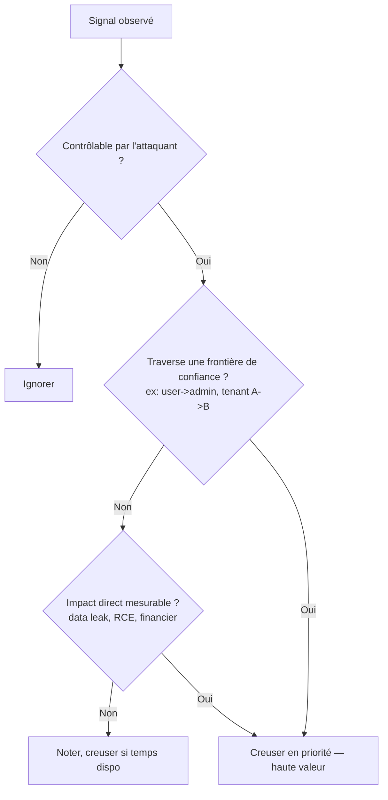

# 01 — Mindset & Methodology

## La méthodologie BugLibrary : PTES adapté au Bug Bounty

Le PTES classique (Pre-engagement, Intelligence Gathering, Threat Modeling, Vulnerability Analysis, Exploitation, Post-Exploitation, Reporting) est pensé pour du pentest sous contrat avec un périmètre figé et un temps borné. Le bug bounty est différent : périmètre mouvant, concurrence avec d'autres hunters, ROI horaire à optimiser. Adaptation :

### Étape 1 — Scope & Program Intel
Avant tout, lis le programme en entier : scope in/out, sévérités primées, exclusions connues (self-XSS, clickjacking sans impact, rate limiting seul, etc.), historique de paiement (Glassdoor-like via HackerOne Hacktivity), âge du programme. **Un programme jeune (< 6 mois) sur H1 a un taux de duplicate bien plus faible.**

> 💡 **Pro tip :** Sur HackerOne, consulte le "Hacktivity" du programme (rapports publiés) pour calibrer le niveau de sévérité qu'ils acceptent réellement — beaucoup de programmes disent "on accepte les IDOR" mais paient différemment selon l'impact démontré.

### Étape 2 — Attack Surface Mapping
Voir [`02-Reconnaissance`](../02-Reconnaissance/README.md) en détail. Résultat attendu : une liste d'assets (domaines, sous-domaines, apps mobiles, APIs, buckets cloud) triés par surface d'attaque probable.

### Étape 3 — Target Triage & Prioritization
Tous les assets ne se valent pas. Utilise une grille de priorisation :

| Critère | Poids | Exemple de signal fort |
|---|---|---|
| Fonctionnalité sensible | ⭐⭐⭐⭐⭐ | Paiement, auth, upload, admin panel, API interne |
| Nouveauté du code | ⭐⭐⭐⭐ | Sous-domaine `beta.`, `staging.`, changelog récent |
| Complexité technique | ⭐⭐⭐⭐ | Microservices multiples, SSR + API séparée, GraphQL |
| Faible couverture apparente | ⭐⭐⭐ | Peu/pas de rapports Hacktivity dessus, doc technique qui fuite (Swagger, GraphiQL exposés) |
| Stack connue pour ses pièges | ⭐⭐⭐ | Frameworks avec CVE récurrentes, vieux WordPress plugins, Spring/Struts legacy |
| Surface utilisateur large | ⭐⭐ | Multi-tenant, comptes B2B avec rôles complexes |

**Règle d'or :** ne creuse pas un asset qui a 500 rapports publics dupliqués avant d'avoir épuisé les assets à faible couverture.

### Étape 4 — Hypothesis-Driven Hunting

C'est le cœur différenciant de la méthodologie. Au lieu de "je lance Burp Scanner sur tout", tu formules des hypothèses falsifiables basées sur l'observation :

**Structure d'une hypothèse :**
> "Étant donné [observation concrète], il est probable que [mécanisme technique] soit implémenté de façon [vulnérable de telle manière], ce qui permettrait [impact]. Je vais tester par [action précise]."

**Exemples concrets :**

| Observation | Hypothèse | Test |
|---|---|---|
| Endpoint `/api/v2/user/{id}/invoice` retourne du JSON avec `id` numérique séquentiel | Pas de contrôle d'autorisation par objet (IDOR) | Changer `{id}` pour un ID voisin avec un token d'un autre compte |
| Réponse HTTP contient header `X-Powered-By: Express` + route `/graphql` accessible | Introspection GraphQL probablement active, schéma exposé | Requête `__schema` introspection |
| Champ "upload avatar" accepte des images, l'URL de la ressource ressuscitée est prévisible | Pas de validation de type MIME réelle côté serveur, possible stockage direct exécutable | Upload polyglot (image+PHP/JS) avec double extension |
| App mobile utilise un certificat pinning absent en version debug leakée | API backend accessible en clair via MITM | Interception Burp/mitmproxy sur build debug |
| Le flow "mot de passe oublié" renvoie un code OTP à 4 chiffres sans lockout visible | Brute-force de l'OTP possible | Test de rate limiting sur endpoint OTP avec Intruder/Turbo Intruder |

> 💡 **Pro tip d'élite :** Les meilleurs hunters passent plus de temps à **lire le comportement de l'application** (erreurs verbeuses, timing, différences subtiles de réponse) qu'à lancer des payloads. La différence entre une réponse 200 en 40ms et une réponse 200 en 400ms peut révéler un blind SSRF ou une injection basée sur le temps.

### Étape 5 — Focused Testing
Teste UNE hypothèse à la fois, documente immédiatement (note prise en notes structurées — voir [`templates/recon-template.md`](../../templates/recon-template.md)), passe à la suivante si négatif. Ne t'enferme pas plus de 30-45 min sur une hypothèse sans nouveau signal.

### Étape 6 — Impact Escalation / Chaining
Voir [`08-Advanced-Techniques`](../08-Advanced-Techniques/README.md). Toujours se demander : "Et si je combinais ce bug avec un autre signal observé plus tôt ?"

### Étape 7-10
Voir les sections [`10-Reporting-and-Communication`](../10-Reporting-and-Communication/README.md) et [`14-Resources-and-Continuous-Learning`](../14-Resources-and-Continuous-Learning/README.md).

## Triage mental en temps réel

Face à une observation suspecte, applique ce filtre en < 10 secondes pour décider si tu creuses :

## Gestion du temps (ROI horaire)

- **Time-box chaque asset** : 2-4h en première passe pour un asset moyen, pas plus, sauf signal fort.
- **Rotation** : si bloqué > 45 min sans nouveau signal, change d'asset ou d'hypothèse plutôt que de forcer.
- **Score personnel de rentabilité** : note pour chaque programme (temps investi / $ obtenu) pour réallouer ton temps vers les programmes qui te rentabilisent le mieux, pas juste ceux avec les plus gros bounties affichés.

## Erreurs classiques à éviter

- ❌ Scanner tout azimut sans hypothèse → génère du bruit, rate limite / bannit ton IP, ne trouve que du connu.
- ❌ Se concentrer uniquement sur l'OWASP Top 10 → laisse filer la logique métier, souvent plus payante.
- ❌ Ne pas relire les changelogs / releases notes des produits ciblés → tu rates les régressions de sécurité fraîches (fenêtre de tir idéale).
- ❌ Ignorer les messages d'erreur "silencieux" (différence de latence, de taille de réponse, de code HTTP subtil).
- ❌ Ne pas garder de notes structurées → tu redécouvres 3 fois le même endpoint sans t'en rendre compte.
