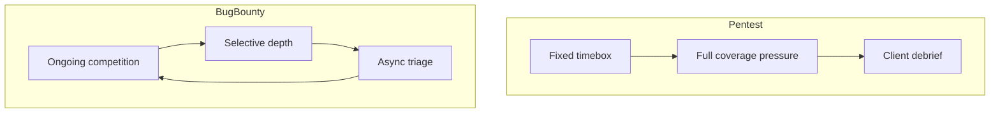

# PTES Adapted to Bug Bounty

<!-- updated: 2026-03 -->

PTES (Penetration Testing Execution Standard) is engagement-shaped. Bug bounty is **continuous, competitive, and scope-constrained**. Adapt phases as loops, not a single waterfall.

## Phase mapping

| PTES phase | BB adaptation | Exit criteria |
|------------|---------------|---------------|
| **Pre-engagement** | Read program policy, scope, out-of-scope, safe harbor, rate limits, asset tags | Written “allowed actions” note |
| **Intelligence gathering** | Recon + ASM + tech fingerprint (in-scope only) | Asset graph + trust boundaries |
| **Threat modeling** | Hypothesis backlog ranked by EV | Top N tests scheduled |
| **Vulnerability analysis** | Safe validation of hypotheses | Confirmed / killed with evidence |
| **Exploitation** | Minimal impact proof (no damage) | Repro steps a triage can run |
| **Post-exploitation** | *Usually limited* — only if in scope; show blast radius carefully | Clear impact narrative |
| **Reporting** | Platform report + attachments | Accepted or actionable feedback |
| **Retest** | After fix | Closure notes |

## Differences from classic pentest



| Dimension | Pentest | Bug bounty |
|-----------|---------|------------|
| Coverage duty | High | Selective (EV) |
| Collaboration | Direct client | Platform + policy |
| DoS testing | Sometimes allowed | Almost always forbidden |
| Credentials | Often provided | Self-signup / tiered |
| Duplicate risk | Low | High — speed with quality |

## BB-PTES daily loop (elite)

```text
1. Policy delta check (changelog / new assets)
2. ASM update (15–45 min)
3. Pick 1–3 highest EV hypotheses
4. Validate with minimal traffic
5. If finding: draft impact while fresh
6. Log dead ends to graveyard
7. Schedule retests / duplicates watch
```

## Pro tips

- Treat **policy PDFs** as the real SoW  
- “Wildcard domain” ≠ “every product ever” — read exclusions  
- Credential policies (no SQLi on login, no 2FA bypass spam) are phase constraints  

## FR — Résumé

Adapter PTES en **boucle continue** : pré-engagement = lire le programme ; intel = ASM ; threat model = backlog d’hypothèses ; exploitation = PoC minimal ; reporting = clarté triage. Le BB récompense la profondeur sélective, pas la couverture forcée.
