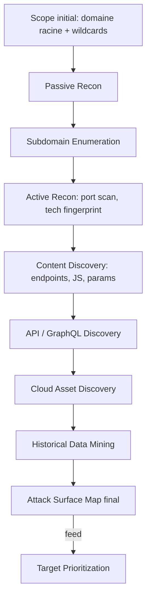

# 02 — Reconnaissance & Attack Surface Mapping

> La reconnaissance représente 60-70% du temps d'un hunter d'élite sur un programme mature. C'est là que se trouve l'avantage compétitif face aux autres chasseurs.

## Objectif

Construire une carte exhaustive de la surface d'attaque : domaines, sous-domaines, IPs, ports, technologies, endpoints API, apps mobiles, buckets cloud, dépôts de code exposés, employés/identités (pour le social engineering scope-autorisé en red team uniquement).

## Méthodologie en couches



## 1. Passive Reconnaissance

**Aucune requête directe vers la cible** — tout via des sources tierces pour rester furtif au maximum au début.

| Source | Usage |
|---|---|
| `crt.sh`, Censys, SecurityTrails | Certificats TLS → sous-domaines historiques |
| Shodan, FOFA, ZoomEye | Bannières de service, ports ouverts, historique d'IP |
| Wayback Machine (`web.archive.org`), `waybackurls` | URLs historiques, endpoints supprimés mais parfois toujours actifs |
| GitHub/GitLab code search, `gitleaks`, `trufflehog` | Secrets fuités, endpoints internes dans du code public/oublié |
| LinkedIn, job postings | Stack technique annoncée par les recrutements ("cherche dev Kubernetes/GraphQL/Kafka") |
| DNS historique (SecurityTrails, DNSDumpster) | Sous-domaines désactivés mais potentiellement re-pointables (subdomain takeover) |
| `BuiltWith`, Wappalyzer (sur cache, pas live) | Stack techno probable |

> 💡 **Pro tip :** Les dépôts GitHub d'anciens employés (pas seulement l'org officielle) fuitent souvent des configs, tokens, ou schémas d'architecture internes. Cherche `org:CIBLE` mais aussi les forks et les gists liés aux emails `@cible.com`.

## 2. Subdomain Enumeration

```bash
# Stack combinée — ne jamais se fier à un seul outil
subfinder -d cible.com -all -recursive -o subs_subfinder.txt
amass enum -passive -d cible.com -o subs_amass.txt
assetfinder --subs-only cible.com > subs_assetfinder.txt
cat subs_*.txt | sort -u > all_subs.txt

# Résolution DNS + filtrage des vivants
dnsx -l all_subs.txt -resp -o resolved.txt
httpx -l resolved.txt -status-code -title -tech-detect -o alive_http.txt
```

**Techniques complémentaires modernes :**
- **Permutation/mutation** (`altdns`, `gotator`, `dnsgen`) sur les sous-domaines connus pour découvrir des variantes (`api-staging.`, `internal-api.`, `v2-api.`).
- **Certificate Transparency streaming** en continu (`ctfr`, monitoring crt.sh en tâche planifiée) pour capter les nouveaux sous-domaines dès leur émission — fenêtre de tir avant que les autres hunters ne les trouvent.
- **Reverse whois / ASN mapping** (`amass intel -asn`) pour trouver des IP/ranges appartenant à l'organisation, indépendamment du nom de domaine.
- **Cloud asset guessing** : `s3-cible`, `cible-backup`, `cible-dev`, `cible-prod`, `cible-staging` sur S3/GCS/Azure Blob avec des outils comme `cloud_enum`, `S3Scanner`.

## 3. Active Reconnaissance

```bash
# Port scan ciblé (respecter le scope et les règles du programme — certains interdisent le scan de ports)
naabu -l alive_http.txt -top-ports 1000 -o open_ports.txt
nmap -sV -iL open_ports.txt -oA nmap_scan

# Fingerprint techno précis
httpx -l alive_http.txt -tech-detect -title -server -o tech_fingerprint.txt
```

> ⚠️ **Attention scope :** Beaucoup de programmes de bug bounty **interdisent explicitement** le port scanning agressif ou limitent à certains hosts. Toujours vérifier les règles avant de scanner — un scan hors règles peut entraîner un ban du programme, même sans exploitation.

## 4. Content Discovery

```bash
# Fuzzing de répertoires/fichiers — wordlists modernes, pas SecLists 2018
ffuf -u https://target.com/FUZZ -w /path/to/wordlist -mc 200,301,302,401,403 -o ffuf_results.json

# Extraction d'endpoints depuis le JS (souvent la vraie mine d'or)
katana -u https://target.com -js-crawl -o katana_endpoints.txt
# ou manuellement :
python3 -c "import re,requests; ..." # extraction regex de endpoints dans bundles JS

# Découverte de paramètres cachés
arjun -u https://target.com/api/endpoint -o params.json
paramspider -d target.com
```

**Sources à ne jamais négliger pour le JS :**
- Bundles webpack/vite non minifiés en `staging`/`dev` (souvent moins optimisés → plus de fuite de logique).
- Sourcemaps (`.js.map`) accidentellement exposées → code source quasi-complet reconstructible.
- Comments laissés dans le JS (`// TODO: remove before prod`, `// FIXME auth bypass temp`).

> 💡 **Pro tip d'élite :** Diffe le JS bundle entre deux dates (via Wayback Machine ou monitoring automatisé) pour repérer les changements de logique métier récents — c'est souvent là qu'apparaissent des régressions de sécurité fraîches, avant que quiconque d'autre ne les remarque.

## 5. API & GraphQL Discovery

Voir détail complet dans [`04-API-GraphQL-Hunting`](../04-API-GraphQL-Hunting/README.md). Signaux de recon à chercher dès cette phase :
- `/swagger.json`, `/openapi.json`, `/api-docs`, `/v2/api-docs`
- `/graphql`, `/graphiql`, `/playground`, introspection active
- Headers `X-Api-Version`, patterns d'URL `/api/v1/`, `/api/v2/` (versions plus anciennes souvent moins sécurisées et toujours actives)
- Fichiers `.postman_collection.json` exposés publiquement (GitHub, sites de partage)

## 6. Cloud Asset Discovery

Voir [`06-Cloud-and-Infrastructure`](../06-Cloud-and-Infrastructure/README.md) pour le détail. Check rapide en phase recon :

```bash
cloud_enum -k cible -k cible-prod -k cible-dev -k cible-backup
# S3 buckets, GCS buckets, Azure blobs mal configurés en accès public
```

## 7. Historical & Leak-Based Discovery

- **Breach data** (via services légaux comme HaveIBeenPwned pour vérifier l'exposition d'identifiants — jamais utiliser des credentials leakés pour login sans autorisation explicite écrite du programme).
- **Pastebin/paste sites monitoring** pour fuite de config/tokens.
- **Dépendances tierces** (`npm`, `pip`) — vérifier si la cible a publié des packages internes mal nommés/publics par erreur (dependency confusion potentiel).

## Organisation des données de recon

Structure recommandée par cible :

```
recon/
├── <target>/
│   ├── subdomains/
│   ├── endpoints/
│   ├── screenshots/        (via gowitness/aquatone)
│   ├── tech_stack.md
│   ├── notes.md            (voir templates/recon-template.md)
│   └── diff/                (JS/endpoint diffs dans le temps)
```

> 💡 **Pro tip :** Automatise un diff quotidien/hebdomadaire (nouveaux sous-domaines, nouveaux endpoints JS, changements de version) sur tes programmes prioritaires — c'est la base d'un pipeline de monitoring continu. Voir [`09-Automation-and-Tooling`](../09-Automation-and-Tooling/README.md).

## Checklist rapide

Voir [`12-Checklists-and-CheatSheets/Recon-Checklist.md`](../12-Checklists-and-CheatSheets/Recon-Checklist.md) pour la version imprimable/actionnable complète.
