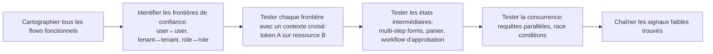

# 03 — Web Application Hunting

Cette section couvre les catégories de vulnérabilités web à plus fort ROI en bug bounty moderne (2024-2026). Chaque sous-fichier suit le squelette : Contexte → Comment tester → Comment confirmer l'impact → Remédiation → Références.

## Sous-sections

| Fichier | Contenu |
|---|---|
| [`01-XSS.md`](01-XSS.md) | XSS reflétée/stockée/DOM, bypass CSP, mutation XSS, DOM clobbering |
| [`02-SQLi.md`](02-SQLi.md) | Injection SQL classique/blind/OOB, NoSQL injection |
| [`03-SSRF.md`](03-SSRF.md) | SSRF classique, blind, bypass de filtres, cloud metadata |
| [`04-Auth-and-Access-Control.md`](04-Auth-and-Access-Control.md) | IDOR, broken auth, JWT, OAuth, privilege escalation |
| [`05-Business-Logic.md`](05-Business-Logic.md) | Race conditions, workflow bypass, abus financier |
| [`06-File-Upload-and-Deserialization.md`](06-File-Upload-and-Deserialization.md) | Upload malveillant, désérialisation, SSTI |

## Priorisation par ROI observé (2024-2026)

D'après l'analyse de la Hacktivity publique et des tendances de paiement récentes :

| Catégorie | Fréquence de découverte | Sévérité moyenne | Difficulté |
|---|---|---|---|
| IDOR / Broken Access Control | Très haute | Moyenne-Haute | Faible-Moyenne |
| Business Logic (race conditions, workflow abuse) | Moyenne | Haute-Critique | Moyenne-Haute |
| SSRF (surtout cloud metadata) | Moyenne | Haute-Critique | Moyenne |
| Auth bypass (JWT, OAuth, SSO) | Moyenne | Critique | Haute |
| XSS stockée à impact réel | Haute | Moyenne | Faible |
| SQLi | Faible (déclinante sur cibles matures) | Critique | Faible-Moyenne |
| SSTI / Deserialization → RCE | Faible | Critique | Haute |
| Request Smuggling / Cache Poisoning | Faible | Haute-Critique | Très Haute |

> 💡 **Pro tip stratégique :** Sur les gros programmes matures (Google, Meta, grandes banques), le SQLi classique est quasi épuisé côté surface évidente. La logique métier et l'IDOR chaîné restent la mine d'or, car ils demandent une compréhension fonctionnelle profonde que les scanners automatiques n'ont pas.

## Approche générale de test

## Outils de base indispensables

- **Burp Suite Pro** (Repeater, Intruder, Extender avec extensions : Autorize, JS Link Finder, Param Miner, Turbo Intruder)
- **Caido** (alternative moderne, rapide, bon pour les gros volumes de requêtes)
- **Postman/Insomnia** pour les APIs complexes avec collections partagées
- Voir [`09-Automation-and-Tooling`](../09-Automation-and-Tooling/README.md) pour la stack complète.
