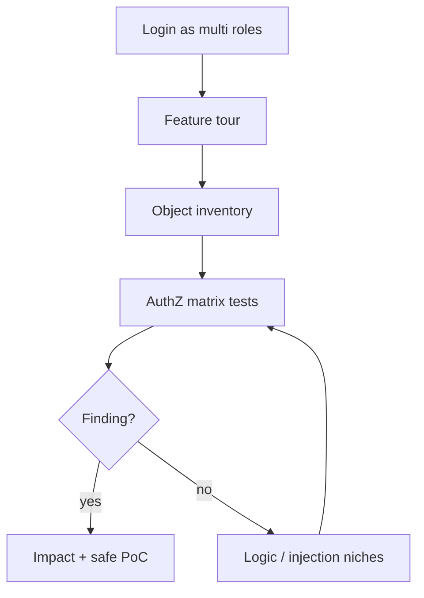

# Web Hunting Playbook

<!-- updated: 2026-03 -->

## English — Operating sequence

1. **Accounts** — create role set (userA, userB, low-priv, if allowed admin trial)  
2. **Map** — authenticated spider + manual click-every-feature  
3. **Matrix** — objects × actions × roles  
4. **Hypotheses** — prioritize authZ and money flows  
5. **Validate** — two-account proofs, minimal payloads  
6. **Chain** — only after atomic issues understood  
7. **Report** — impact in business language  

## High-EV web surfaces (SaaS)

| Surface | Why |
|---------|-----|
| Team/org membership | Classic IDOR + invite flaws |
| File/share links | AuthZ on tokens |
| Export/report jobs | Async IDOR, SSRF to fetchers |
| Admin impersonation | Vertical authZ |
| Billing/seats | Logic + IDOR |
| Search | Injection / info leak |
| Webhooks | SSRF, weak secrets |

## What “modern 2024–2026” changed

- SPAs + BFF: more JWT/cookie hybrids  
- GraphQL coexisting with REST  
- Edge middleware auth gaps  
- Feature-flag half-rolled endpoints  
- Bot management — logic bugs still dominate payouts  

## FR

Séquence : multi-comptes → tour features → matrice objets/actions/rôles → authZ d’abord → logique → injections ciblées → rapport business.
