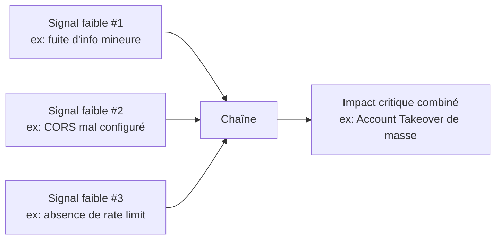

# 08 — Advanced Techniques & Chaining

## Philosophie du chaînage

> Un bug isolé a une valeur. Un bug **chaîné** a une valeur exponentielle. L'élite ne s'arrête jamais à la première vulnérabilité trouvée — elle se demande systématiquement "et avec quoi puis-je combiner ça ?"



## HTTP Request Smuggling

### Contexte

Exploite une désynchronisation d'interprétation de la longueur d'un corps de requête entre un frontend (CDN/reverse proxy/load balancer) et un backend, quand les deux composants interprètent différemment les headers `Content-Length` et `Transfer-Encoding`.

### Types de désynchronisation

| Type | Frontend interprète | Backend interprète |
|---|---|---|
| CL.TE | Content-Length | Transfer-Encoding |
| TE.CL | Transfer-Encoding | Content-Length |
| TE.TE | Les deux acceptent TE mais l'un peut être trompé de ne pas le traiter (obfuscation du header) |

### Détection (méthode PortSwigger — timing-based, la plus fiable)

```http
POST / HTTP/1.1
Host: target.com
Content-Length: 4
Transfer-Encoding: chunked

1
A
X
```
Si une désynchronisation CL.TE existe, le backend attend plus de données que ce qui a été envoyé → délai de réponse observable (timeout caractéristique).

> 💡 **Pro tip d'élite :** Utilise le module **HTTP Request Smuggler** (extension Burp de James Kettle) pour l'automatisation de la détection différentielle — il teste systématiquement les variantes d'obfuscation de `Transfer-Encoding` (espaces, tabs, casse) que le frontend/backend peuvent traiter différemment.

### Exploitation

- **Request smuggling → cache poisoning** : empoisonner le cache partagé avec une réponse malveillante servie à toutes les victimes suivantes.
- **Request smuggling → session hijacking** : faire en sorte qu'une requête "de contrebande" capture la réponse destinée à la prochaine requête d'un autre utilisateur sur la même connexion backend réutilisée.
- **Bypass de contrôles frontend** (WAF, authentification au niveau reverse proxy) en glissant une requête interne non filtrée par le frontend.

## Web Cache Poisoning / Deception

### Cache Poisoning

```
1. Identifier les "cache keys" (souvent juste l'URL + méthode, PAS les headers)
2. Identifier un "cache buster" non inclus dans la clé de cache mais qui influence la réponse
   (headers X-Forwarded-Host, X-Forwarded-Scheme, paramètres non-canoniques ignorés par la clé)
3. Injecter un payload via ce vecteur non-key qui altère la réponse (ex: XSS via header reflété)
4. La réponse empoisonnée est mise en cache et servie à toutes les victimes suivantes
```

**Vecteurs "unkeyed input" fréquents :**
```http
X-Forwarded-Host: evil.com          # si reflété dans un lien canonique/redirect généré
X-Forwarded-Scheme: http            # downgrade forcé
X-Original-URL: /admin              # override de routage interne
Accept-Language: <payload>          # si reflété dans une page d'erreur cachée
```

> 💡 **Pro tip :** Utilise **Param Miner** (extension Burp) pour découvrir automatiquement les headers/paramètres "unkeyed" qui influencent la réponse — c'est le point de départ systématique de toute recherche de cache poisoning.

### Cache Deception

Exploite une confusion d'extension de fichier statique côté cache (ex: `/account/settings/nonexistent.css` traité comme une ressource statique cacheable par le CDN mais routé côté app vers la page de settings authentifiée réelle) → la réponse personnalisée de la victime se retrouve mise en cache sous une URL prévisible.

## Prototype Pollution (JavaScript)

### Contexte

Exploite la modification du prototype d'objets JavaScript (`Object.prototype`) via des clés spéciales (`__proto__`, `constructor.prototype`) dans une fusion d'objets non sécurisée (`merge`, `extend`, parsing JSON récursif custom).

### Détection côté client

```javascript
// Payload de test dans un paramètre URL/JSON fusionné par l'app
?__proto__[polluted]=true
{"__proto__": {"polluted": "true"}}

// Vérifier dans la console :
console.log({}.polluted)  // "true" si pollution réussie
```

### Escalade vers XSS (gadget de pollution → sink)

```
1. Identifier un "gadget" : du code de l'app qui lit une propriété d'objet
   non définie explicitement mais qui existerait sur Object.prototype après pollution
   (ex: une lib qui vérifie `options.transform_html` avant de faire un innerHTML).
2. Polluer cette propriété avec un payload qui active un sink dangereux.
```

### Prototype Pollution côté serveur (Node.js) → RCE potentiel

Certains gadgets connus dans des libs Node populaires (versions vulnérables de `lodash`, `minimist`, moteurs de template) permettent d'escalader une pollution de prototype jusqu'à une exécution de code — vérifier les CVE spécifiques à la version de la lib identifiée.

## Cross-Site Request Forgery (CSRF) — cas avancés 2024-2026

Le CSRF classique décline (SameSite=Lax par défaut sur navigateurs modernes), mais reste exploitable via :
- **JSON CSRF avec Content-Type flexible** (endpoint acceptant `Content-Type: text/plain` pour du JSON → formulaire HTML classique suffisant).
- **Login CSRF** — forcer la victime à se connecter avec les identifiants de l'attaquant pour capturer ensuite ses actions sur un compte contrôlé.
- **SameSite bypass via sous-domaine** — si un sous-domaine partage le cookie (`Domain=.target.com`) et contient une vulnérabilité type XSS/open redirect, `SameSite=Lax/Strict` ne protège pas contre une requête initiée depuis ce sous-domaine.

## Clickjacking avancé — au-delà du `X-Frame-Options` manquant

- **Multi-step clickjacking** — enchaîner plusieurs clics invisibles pour valider un formulaire multi-étapes (ex: activation 2FA vers un secret contrôlé par l'attaquant).
- **Drag-and-drop clickjacking** — exfiltration de données via un drag-and-drop détourné entre iframe et page attaquante (vol de texte sélectionné, tokens visibles à l'écran).

## Open Redirect → escalade

Un open redirect seul est souvent hors scope/low severity, mais chaîné il devient puissant :
- Contournement de whitelist `redirect_uri` OAuth (voir 03/04).
- Bypass de filtre SSRF qui valide seulement le domaine initial avant de suivre une redirection.
- Amélioration de crédibilité d'un phishing (lien qui commence par le vrai domaine de la cible).

## Comment confirmer l'impact des techniques avancées

- Request smuggling : capture Wireshark/Burp montrant la désynchronisation exacte, avec démonstration d'impact concret (pas juste "délai observé").
- Cache poisoning : preuve que la réponse empoisonnée est bien servie à une **requête subséquente distincte** (nouvelle session/navigateur), pas juste à la requête d'origine.
- Prototype pollution : chaîne complète pollution → gadget → sink observable (XSS déclenchée, pas juste `polluted: true` dans la console).

## Références

- PortSwigger Research — "HTTP Request Smuggling", "Practical Web Cache Poisoning" (James Kettle)
- PortSwigger Web Security Academy — toutes les catégories ci-dessus
- `HTTP Request Smuggler`, `Param Miner` (extensions Burp)
- PayloadsAllTheThings — Prototype Pollution, CSRF
