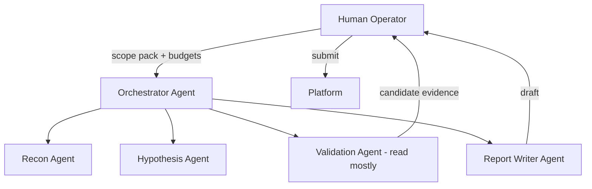

# AI Agents in Bug Hunting

<!-- updated: 2026-03 -->

> **EN:** How elite teams use LLMs and multi-agent systems without losing scope, OPSEC, or signal.  
> **FR:** Comment les équipes d’élite utilisent les LLM et multi-agents sans perdre scope, OPSEC ni signal.

---

## English

### Role of AI (correct mental model)

AI agents are **junior hunters with infinite stamina and imperfect judgment**.  
Humans own: scope, legal risk, final severity, report submission, and any state-changing action policy.



### Agent roles

| Agent | Allowed | Forbidden |
|-------|---------|-----------|
| **Scope Guardian** | Parse policy; flag OOS | Never greenlight OOS assets |
| **Recon** | Passive/soft active in-scope | Mass scan OOS, secret abuse |
| **Hypothesis** | Generate H-cards from ASM | Invent criticals without evidence |
| **Validation** | Safe, low-rate tests | Destructive payloads, DoS |
| **Reporter** | Structure findings | Exaggerate severity |
| **Reviewer** | Adversarial check of draft | Submit without human |

### Orchestration contract (YAML-like)

```yaml
program_id: acme-bb
scope_pack: ./scope.json   # hosts, wildcards, OOS, rate
budgets:
  max_rps: 2
  max_requests_per_hour: 1200
  max_parallel_validations: 1
gates:
  state_changing_requests: human_approve
  report_submission: human_only
  collaborator_interactions: allow_list_only
outputs:
  asm: ./out/asm.yaml
  hypotheses: ./out/hypotheses/
  evidence: ./out/evidence/
  report_drafts: ./out/reports/
```

### Prompt patterns (high signal)

#### 1) Scope Guardian system prompt (skeleton)

```text
You enforce bug bounty policy. Input: policy text + asset list.
Output JSON: {allowed: [], denied: [], questions: [], rate_limits: [], unsafe_actions: []}.
If uncertain, deny and ask. Never invent scope. Refuse illegal activity.
```

#### 2) Hypothesis generator

```text
Given ASM YAML and role matrix, produce 15 falsifiable hypotheses.
Prefer authZ and business logic. Each hypothesis: asset, trust_boundary,
claim, test_plan, ev_score 1-5, risk_notes. No exploit code.
```

#### 3) Validation planner

```text
Turn hypothesis H into minimal safe steps using only listed accounts.
Max 20 requests. No destructive verbs unless hypothesis requires and human_approved=true.
Output step list + expected evidence.
```

#### 4) Report writer

```text
Write a triage-friendly report: summary, steps, impact (business),
affected assets, remediation. Use neutral tone. No severity inflation.
Mark unknowns clearly.
```

#### 5) Adversarial reviewer

```text
Attack this draft: weak impact? missing preconditions? possible duplicate class?
Is PoC minimal? Any scope violation? Return MUST-FIX list.
```

### Multi-agent workflow (daily)

1. Human loads **scope pack** (canonical)  
2. Recon agent proposes ASM delta → human accepts  
3. Hypothesis agent produces backlog → human ranks top 5  
4. Validation agent executes **read-mostly** plans  
5. On candidate: human reproduces once  
6. Report agent drafts → reviewer agent critiques → human submits  

### OPSEC for AI

| Risk | Mitigation |
|------|------------|
| Pasting secrets into cloud LLM | Redact tokens; local models for sensitive HAR |
| Training data leakage concerns | Enterprise privacy mode / self-host |
| Agent runaway scanning | Hard RPS + allowlist network egress |
| Hallucinated “findings” | Require raw evidence artifacts |
| Prompt injection from target pages | Treat page content as untrusted input |

### Prompt injection from targets

If an agent fetches HTML/JS containing “ignore previous instructions”, the **orchestrator must sandbox tool results** as data, never as instructions. Strip system-role elevation from retrieved content.

### Evaluation metrics for AI hunting systems

- Valid report rate (not raw “issues found”)  
- Human rework minutes per draft  
- Scope violations count (target: 0)  
- $ per human-hour (true north)  

### Anti-patterns

- Fully autonomous submit  
- Agents with open internet and no allowlist  
- “Find all CVEs” megaprompts  
- Using AI to generate weaponized malware  

### Pro tips

- Feed agents **structured ASM**, not 200MB proxy dumps  
- Keep a **tool allowlist** (http client with scope middleware)  
- Store prompts in git; version them like code  
- One agent should specialize in **duplicate detection** against your past reports  

---

## Français

### Modèle mental

Les agents IA = **juniors infatigables au jugement imparfait**. L’humain garde scope, légal, sévérité finale, soumission.

### Rôles

Gardien de scope, recon, hypothèses, validation (surtout lecture), rédacteur, reviewer.  
Gates : actions à effet de bord et soumission = **humain**.

### OPSEC IA

Pas de secrets dans le LLM cloud ; budgets RPS ; allowlist ; preuves brutes obligatoires ; méfiance injection de prompt via pages cibles.

### Anti-patterns

Soumission autonome, scan sans bride, prompts “trouve tous les CVE”, génération de malware.

---

## Cross-links

- Automation: [`../09-Automation-and-Tooling/`](../09-Automation-and-Tooling/)  
- Legal/OPSEC: [`../11-Legal-Ethics-and-OPSEC/`](../11-Legal-Ethics-and-OPSEC/)  
- Templates: [`../../templates/`](../../templates/)  
