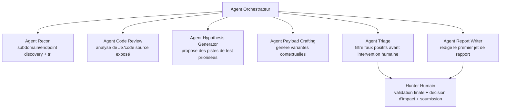

# Agents IA dans le Bug Hunting — Orchestration, Prompts & Workflows

## Pourquoi les agents IA changent la donne (2024-2026)

Les LLMs modernes ne remplacent pas le jugement d'un hunter expert sur l'impact et le chaînage créatif, mais ils excellent à **industrialiser les tâches à fort volume et faible créativité** : parsing de masse, génération de variantes de payloads, triage de faux positifs, rédaction de premiers jets de rapport, résumé de code source pour identifier des zones à risque.

## Architecture d'orchestration recommandée



**Principe non négociable :** un agent IA ne soumet JAMAIS un rapport sans validation humaine finale, et n'exécute JAMAIS d'action à impact réel (exploitation active, extraction de données, action destructrice) sans supervision directe. L'IA accélère la découverte et la rédaction ; l'humain reste responsable de la décision et de l'éthique de l'action.

## Rôles d'agents et prompts types

### 1. Agent Recon — tri et priorisation d'assets

```
Rôle : Tu es un analyste de reconnaissance en sécurité offensive.
Contexte : Voici une liste de N sous-domaines découverts avec leur statut HTTP,
titre de page, technologie détectée (fingerprint httpx).
Tâche : Classe ces assets par priorité de test décroissante selon les critères :
(1) présence de fonctionnalité sensible probable (auth, paiement, admin, upload),
(2) signal de nouveauté (staging/beta/dev/v2 dans le nom),
(3) stack technique associée à des CVE récentes connues,
(4) absence de couverture apparente (pas de mention dans les rapports publics connus).
Format de sortie : tableau trié avec score 1-10 et justification en une ligne par asset.
Ne conclus jamais qu'un asset est "sûr" — seulement une priorité de test.
```

### 2. Agent Code Review — analyse de JS/code exposé

```
Rôle : Tu es un auditeur de code source orienté sécurité offensive.
Contexte : Voici un extrait de bundle JavaScript non minifié / code source exposé.
Tâche : Identifie tout endpoint API référencé, tout paramètre de requête construit
dynamiquement, toute logique d'autorisation effectuée côté client (donc contournable),
tout sink DOM dangereux (innerHTML, eval, document.write), et tout secret/clé en dur.
Format de sortie : liste structurée avec l'extrait de code exact, le fichier/ligne si
disponible, et la classe de vulnérabilité potentielle associée.
N'affirme jamais qu'une vulnérabilité est confirmée — seulement une piste à tester manuellement.
```

### 3. Agent Hypothesis Generator — hunting piloté par hypothèses

```
Rôle : Tu es un chercheur de vulnérabilités senior appliquant le hunting piloté
par hypothèses (voir méthodologie BugLibrary 01-Mindset-and-Methodology).
Contexte : [observations concrètes sur la cible — stack, endpoints, comportement observé]
Tâche : Formule 5 à 10 hypothèses falsifiables au format :
"Étant donné [observation], il est probable que [mécanisme] soit vulnérable à
[classe de vuln], ce qui permettrait [impact]. Test précis : [action exacte à exécuter]."
Priorise les hypothèses par ratio impact potentiel / effort de test estimé.
```

### 4. Agent Payload Crafting — génération contextuelle

```
Rôle : Tu génères des variantes de payload adaptées à un contexte d'injection précis.
Contexte : [contexte exact observé — ex: injection dans un attribut HTML avec guillemets
doubles filtrés, WAF détecté: Cloudflare, framework: Express/Node]
Tâche : Génère 15 variantes de payload XSS adaptées à ce contexte exact et à ce WAF
connu, en expliquant pour chaque variante quelle technique de bypass elle utilise
(encodage, casse, événement alternatif, etc.). Trie par probabilité de succès estimée.
```

### 5. Agent Triage — filtrage de faux positifs

```
Rôle : Tu es un triager senior de bug bounty évaluant la validité technique d'une
observation avant intervention humaine.
Contexte : [requête/réponse HTTP brute, ou résultat d'un scan automatisé]
Tâche : Évalue si ce résultat constitue un faux positif probable (comportement
attendu de l'application, protection déjà en place, impact nul) ou un signal
nécessitant investigation humaine. Justifie en 2-3 phrases maximum.
Sois conservateur : en cas de doute réel, classe "à investiguer", ne rejette jamais
un signal ambigu comme faux positif par excès de confiance.
```

### 6. Agent Report Writer — premier jet de rapport

```
Rôle : Tu rédiges un rapport de vulnérabilité de bug bounty au format BugLibrary
(voir templates/bug-report-template.md).
Contexte : [description technique de la vulnérabilité confirmée par le hunter humain,
requêtes/réponses de preuve, impact démontré]
Tâche : Rédige un rapport complet et professionnel : résumé exécutif, étapes de
reproduction numérotées précises, impact business explicite, sévérité justifiée
(référence CVSS si pertinent), remédiation suggérée.
Ne jamais inventer d'étape de reproduction non fournie dans le contexte — si une
information manque, indique-le explicitement plutôt que de combler par supposition.
```

## Garde-fous obligatoires pour tout agent IA en bug hunting

1. **Aucune action d'exploitation active sans validation humaine explicite** — un agent peut proposer un payload, jamais l'envoyer contre une cible réelle en autonomie complète sans supervision.
2. **Aucune soumission de rapport automatique** — la décision finale de soumission, la vérification de scope, et la relecture qualité restent humaines.
3. **Traçabilité complète** — chaque action d'un agent (requête envoyée, payload généré, hypothèse testée) doit être loggée pour audit a posteriori.
4. **Respect strict du scope** — un agent recon/orchestrateur doit valider le domaine/asset ciblé contre la liste de scope AVANT tout envoi de requête, jamais après.
5. **Rate limiting appliqué au niveau agent** — un agent qui génère des variantes de payload à tester ne doit pas les envoyer en rafale sans respecter les limites du programme.
6. **Aucune donnée sensible réelle transmise à un LLM tiers non maîtrisé** — anonymiser/tronquer les PII, secrets, tokens réels avant de les inclure dans un prompt envoyé à un service externe, sauf environnement garanti privé/on-premise.

## Workflow concret recommandé pour une session de hunting assistée par IA

```
1. Humain définit le scope et les objectifs de la session.
2. Agent Recon tourne en autonomie sur la découverte passive/semi-active (dans les
   limites du programme), produit une liste priorisée.
3. Humain sélectionne 3-5 assets prioritaires.
4. Agent Hypothesis Generator produit des pistes de test pour chaque asset sélectionné.
5. Humain valide/filtre les hypothèses les plus prometteuses.
6. Agent Payload Crafting assiste sur les hypothèses validées (génération de variantes).
7. Humain exécute les tests réels (Burp Repeater/Intruder) — l'agent peut analyser
   les réponses obtenues pour accélérer l'interprétation, mais l'envoi reste supervisé.
8. Agent Triage aide à trier les résultats ambigus obtenus.
9. Sur confirmation humaine d'une vulnérabilité réelle, Agent Report Writer produit
   un premier jet de rapport.
10. Humain relit, complète, vérifie le scope final, et soumet.
```

## Où les agents IA excellent le plus (ROI le plus haut)

- **Parsing de masse** (bundles JS, réponses d'API volumineuses, résultats de scan bruts) → gain de temps énorme vs. lecture manuelle.
- **Génération de variantes de payload contextuelles** → couverture de bypass bien plus large qu'une wordlist statique.
- **Résumé et triage de faux positifs** sur des scans automatisés bruyants (nuclei, scanners génériques).
- **Rédaction de rapports** — structure, clarté, cohérence — tout en gardant l'humain responsable du contenu factuel.
- **Diff analysis continu** (changements de JS/API entre deux dates) pour repérer les régressions de sécurité fraîches.

## Où l'humain reste irremplaçable

- **Créativité de chaînage** — relier trois signaux faibles disparates en un impact critique.
- **Jugement d'impact business réel** — comprendre la valeur métier exacte d'un abus de logique dans un contexte spécifique.
- **Décision éthique et légale** — jusqu'où pousser une PoC, quand s'arrêter, quand alerter immédiatement plutôt que continuer à creuser.
- **Négociation de triage** — dialogue avec l'équipe sécurité du programme sur la sévérité réelle.

## Références

- Voir [`templates/bug-report-template.md`](../../templates/bug-report-template.md) pour le format cible de l'Agent Report Writer.
- Voir [`11-Legal-Ethics-and-OPSEC`](../11-Legal-Ethics-and-OPSEC/README.md) pour les limites strictes à respecter par tout agent autonome.
