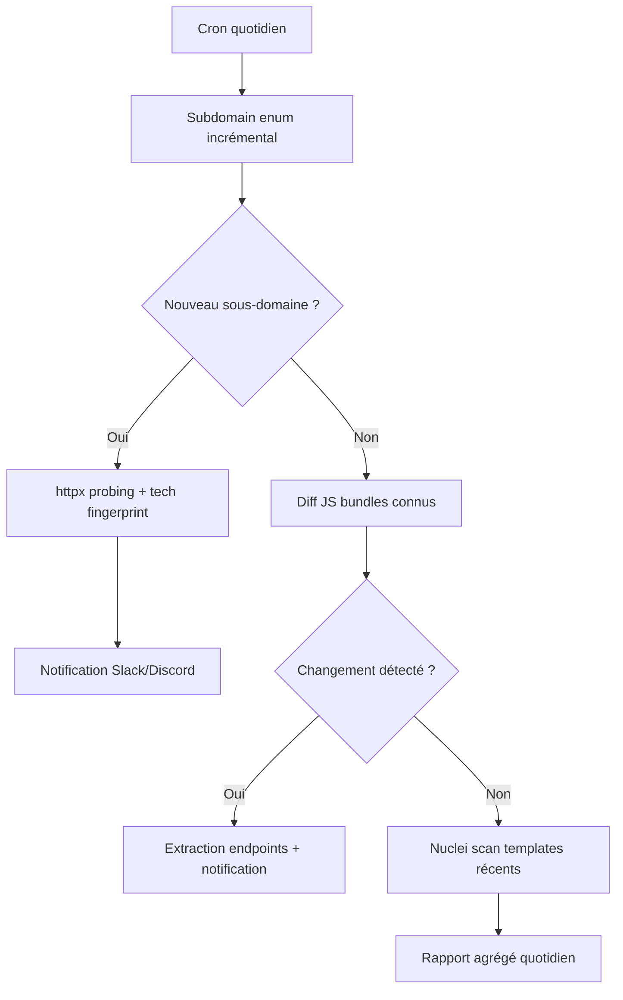

# 09 — Automation & Tooling

## Stack d'outils recommandée (2024-2026)

### Recon & Discovery

| Outil | Rôle |
|---|---|
| `subfinder`, `amass`, `assetfinder` | Subdomain enumeration passive |
| `httpx`, `dnsx` | Résolution et probing HTTP en masse |
| `naabu` + `nmap` | Port scanning |
| `katana`, `gospider` | Crawling et extraction d'endpoints (JS-aware) |
| `nuclei` | Scanning de templates de vulnérabilités connues (CVE, misconfig) — excellent en continu, pas pour du 0-day |
| `ffuf` | Fuzzing de contenu (répertoires, paramètres, vhosts) |
| `arjun`, `paramspider` | Découverte de paramètres cachés |
| `gowitness`, `aquatone` | Screenshots de masse pour triage visuel rapide |

### Exploitation & Testing

| Outil | Rôle |
|---|---|
| Burp Suite Pro | Plateforme centrale — Repeater, Intruder, Extender |
| Caido | Alternative moderne/rapide à Burp pour gros volumes |
| Turbo Intruder | Race conditions, brute-force à très haute performance |
| `sqlmap` | Automatisation SQLi (usage raisonné, pas en mode aveugle sur tout) |
| `jwt_tool` | Attaques JWT |
| Frida / Objection | Instrumentation mobile/binaire |
| `ysoserial` / `ysoserial.net` | Génération de payloads de désérialisation |

### Extensions Burp indispensables

`Autorize` (test d'autorisation automatisé), `Param Miner` (unkeyed input, cache poisoning), `JS Link Finder`, `Turbo Intruder`, `HTTP Request Smuggler`, `Logger++`, `InQL` (GraphQL), `Backslash Powered Scanner`, `Active Scan++`.

## Pipeline d'automatisation type (monitoring continu)



**Squelette de script d'orchestration (concept) :**

```bash
#!/bin/bash
# monitoring_pipeline.sh — à adapter, jamais exécuter sans vérifier les règles du programme
TARGET=$1
subfinder -d $TARGET -silent | httpx -silent -o current_subs.txt
diff previous_subs.txt current_subs.txt > new_subs.txt
if [ -s new_subs.txt ]; then
    notify -bulk -provider slack < new_subs.txt
fi
cp current_subs.txt previous_subs.txt
```

> ⚠️ Toute automatisation doit respecter le rate limiting déclaré par le programme (voir [`11-Legal-Ethics-and-OPSEC`](../11-Legal-Ethics-and-OPSEC/README.md)) — un pipeline de scan agressif tournant 24/7 sans throttling est le moyen le plus rapide de se faire bannir d'un programme, même sans avoir rien exploité.

## Voir aussi

- [`AI-Agents-in-Bug-Hunting.md`](AI-Agents-in-Bug-Hunting.md) — orchestration d'agents IA pour industrialiser recon, triage et rédaction.
- [`scripts/`](../../scripts/) — scripts prêts à l'emploi de ce dépôt.
- [`tools/`](../../tools/) — configurations recommandées (wordlists, templates nuclei custom).
