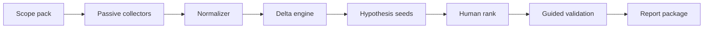

# Pipeline Design

## Components

1. **Scope middleware** — every HTTP client checks allowlist  
2. **Collectors** — CT, passive DNS, lightweight HTTP  
3. **Normalizer** — unified asset schema  
4. **Delta** — alert only on change  
5. **Sink** — notes DB / markdown files  

## Failure modes

| Failure | Fix |
|---------|-----|
| Alert fatigue | Higher thresholds; score EV |
| Scope drift | Re-fetch policy weekly |
| Credential leak in logs | Redaction filters |
| Parallel stampede | Global rate limiter |

## FR

Middleware de scope obligatoire. Alertes sur **delta**. Rate limiter global. Rédaction des secrets dans les logs.
