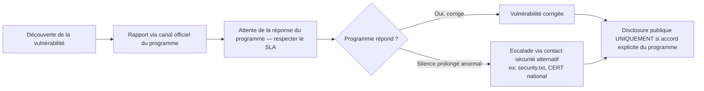

# 11 — Legal, Ethics & OPSEC

## Cadre légal — les fondamentaux non négociables

> ⚠️ Ce document n'est pas un avis juridique. Les lois varient par juridiction (CFAA aux USA, Computer Misuse Act au UK, lois locales en France/UE, etc.). En cas de doute réel sur la légalité d'une action, consulte un juriste spécialisé ou abstiens-toi.

### Règle d'or : le scope écrit du programme EST ta seule autorisation

- Une action est légale dans ce contexte **uniquement** si elle est couverte par le scope explicite d'un programme de bug bounty actif, un contrat de pentest signé, ou un environnement de lab personnel (que tu possèdes ou dont l'usage est explicitement autorisé pour l'entraînement — CTF, PortSwigger Academy, HackTheBox, etc.).
- "Le domaine semblait appartenir à l'entreprise" n'est jamais une autorisation suffisante — vérifie toujours le scope écrit exact (sous-domaines inclus/exclus, IPs, applications mobiles listées).
- Les programmes VDP (Vulnerability Disclosure Program) sans récompense financière ont les mêmes exigences de scope strict qu'un programme payant.

### Actions systématiquement hors limites, même en scope

- Extraction massive de données réelles au-delà du strict nécessaire à la preuve.
- Toute action destructrice (suppression de données, DoS soutenu, dégradation de service).
- Ingénierie sociale contre des employés réels sans autorisation explicite spécifique (hors scope de la majorité des programmes bug bounty classiques).
- Accès à des comptes utilisateurs réels tiers (toujours utiliser des comptes de test créés pour l'occasion).
- Utilisation active de credentials/clés obtenus via une vulnérabilité (les documenter suffit à la preuve).
- Disclosure publique non coordonnée avant résolution ou accord explicite du programme.

## Gestion du scope — méthode pratique

```
1. Lire le scope ET les exclusions ligne par ligne avant de commencer — pas un survol.
2. Noter explicitement : domaines/sous-domaines in-scope, wildcards, apps mobiles listées,
   types de test autorisés (est-ce que le rate-limit testing est explicitement permis ?),
   sévérités primées vs. explicitement exclues (self-XSS, clickjacking sans impact, etc.).
3. En cas d'ambiguïté sur un asset limite (ex: sous-domaine tiers hébergé mais lié) :
   contacter le programme AVANT de tester, pas après avoir trouvé quelque chose.
4. Conserver une copie horodatée du scope au moment du test — les scopes changent,
   et une action légale au moment T peut devenir contestée si le scope a changé
   entre-temps sans que tu aies de preuve de l'état au moment du test.
```

> 💡 **Pro tip :** Screenshote ou archive (via `wget`/`curl` daté) la page de scope du programme au moment où tu commences à tester un asset particulier — cette preuve te protège en cas de litige sur "était-ce in-scope au moment du test".

## OPSEC — Rester furtif et professionnel

### Pourquoi l'OPSEC compte même en scope autorisé

- Éviter de déclencher des alertes SOC qui génèrent du bruit inutile pour l'équipe sécurité cliente (relation à long terme avec le programme).
- Éviter les faux positifs d'incident de sécurité réel côté client (confusion entre ton test autorisé et une vraie attaque en cours).
- Certains programmes pénalisent (voire bannissent) un comportement de scan trop agressif même sans exploitation réelle.

### Bonnes pratiques

| Pratique | Détail |
|---|---|
| Rate limiting personnel | Respecter les limites explicites du programme ; à défaut, rester raisonnable (ex: pas plus de quelques requêtes/seconde sur un fuzzing de contenu, sauf test spécifique de rate-limit autorisé) |
| User-Agent identifiable | Beaucoup de programmes demandent un header custom identifiant le chercheur (ex: `X-Bug-Bounty: <handle>`) — vérifier les règles et l'inclure systématiquement si demandé |
| Éviter le bruit sur les WAF | Ne pas relancer un scan complet après un blocage WAF détecté — analyser plutôt pourquoi et ajuster, pas insister brutalement |
| Fenêtres de test | Certains programmes demandent d'éviter les tests à fort impact potentiel (race conditions, DoS-adjacent) en dehors d'heures ouvrées définies |
| Logs et traces personnelles | Garder ses propres logs de test (requêtes envoyées, horodatage) pour pouvoir répondre à toute question du programme sur une activité observée |
| Infrastructure de test | Utiliser une infra dédiée à la recherche (VPS, IP identifiable si demandé), éviter de mélanger avec ton infra personnelle/professionnelle courante |

### Gestion des données sensibles rencontrées

- **Ne jamais stocker** de PII, credentials, ou secrets réels rencontrés au-delà du strict nécessaire à la preuve (une capture d'écran floutée/tronquée suffit généralement).
- **Chiffrer** toute note contenant des détails sensibles sur une vulnérabilité non encore corrigée.
- **Purger** ses environnements de test (uploads, comptes créés, données injectées) après validation — laisser un état propre.
- **Ne jamais partager** de détails de vulnérabilité non corrigée avec des tiers non autorisés, même en "anonymisant" — le risque de ré-identification existe souvent.

## Disclosure responsable — le protocole standard



> ⚠️ **Jamais de disclosure publique par défaut.** Même après correction, la publication d'un write-up détaillé nécessite généralement l'accord explicite du programme (politique de disclosure coordonnée) — vérifier les règles spécifiques du programme concerné avant toute publication, même partielle.

## Éthique au-delà de la légalité stricte

- La légalité d'une action et son caractère éthique ne sont pas toujours identiques — une action techniquement autorisée par un scope mal rédigé peut rester éthiquement discutable (ex: un scope trop large incluant par erreur des services tiers non liés à l'entreprise).
- En cas de doute éthique réel malgré une autorisation technique, contacter le programme pour clarification plutôt que d'exploiter l'ambiguïté.
- Ne jamais exploiter une vulnérabilité découverte "par accident" hors du cadre d'un engagement autorisé, même si elle semble triviale — signaler via un canal de disclosure responsable standard (`security.txt`, contact sécurité public) sans jamais aller plus loin que la preuve minimale nécessaire.

## Références

- HackerOne / Bugcrowd — Disclosure Guidelines officielles
- `security.txt` (RFC 9116) — standard de contact sécurité
- CFAA (US), Computer Misuse Act (UK), Directive UE NIS2 — cadre légal de référence par juridiction (à vérifier localement)
